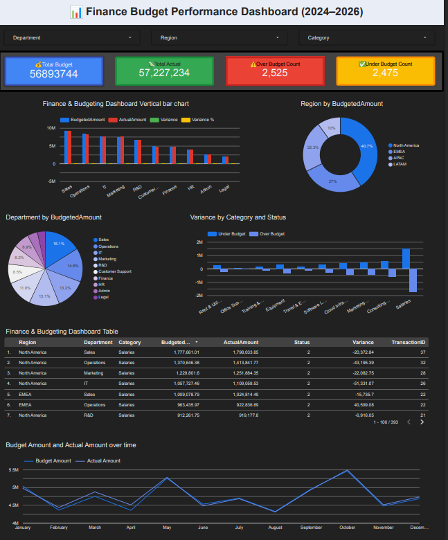

# Finance-Budget-Performance-Dashboard
End-to-end finance dashboard built with Excel and Looker Studio to compare Budget vs. Actual performance, analyze variances, and monitor financial KPIs.
# 📊 Finance Budget Performance Dashboard (2024–2026)

An interactive Finance Budget Performance Dashboard built using **Looker Studio** with **Google Sheets** as the primary data source. This dashboard enables users to monitor budget performance, compare budgeted versus actual expenditures, analyze financial variances, and explore spending trends through dynamic visualizations.

---

## 📌 Overview

This project demonstrates how Business Intelligence tools can transform raw financial data into meaningful insights. The dashboard provides an intuitive interface for tracking organizational budget performance across departments, regions, and expense categories.

This is my **first end-to-end Business Analytics project**, created as part of my learning journey. Throughout the project, I used **Claude AI** as a learning assistant to better understand data analysis concepts, dashboard planning, and visualization techniques while designing and implementing the solution myself.

---

## 🎯 Project Objectives

- Compare Budgeted vs. Actual Spending
- Monitor Budget Variance
- Analyze Department Performance
- Track Regional Spending
- Identify Over Budget & Under Budget Transactions
- Support Data-Driven Decision Making

---

## 📊 Dashboard Features

- 💰 Total Budget KPI
- 💸 Total Actual KPI
- 📉 Budget Variance
- 📊 Variance Percentage
- ⚠️ Over Budget Count
- ✅ Under Budget Count
- 📈 Monthly Budget vs. Actual Trend
- 🏢 Department-wise Budget Comparison
- 🍩 Budget Distribution by Department
- 🌍 Regional Analysis
- 📂 Category-wise Variance Analysis
- 🔍 Interactive Filters (Date, Department, Region & Category)

---

## 🛠️ Tech Stack

- Looker Studio
- Google Sheets
- Microsoft Excel
- Data Visualization
- Business Intelligence (BI)
- Financial Analysis
- Claude AI (AI-assisted learning)

---

## 📸 Dashboard Preview

``

## 🌐 Live Dashboard

🔗 **Looker Studio Dashboard:**  
(https://datastudio.google.com/s/gNcxcr0gZJQ)

🔗 **Google Sheets Dataset:**  

https://docs.google.com/spreadsheets/d/115p9REcrBcKE1hGSzNR3BeEadVQmP4HuKPmC3h4XMOY/edit?usp=sharing
---

## 📈 Key Insights

- Monitor financial performance across multiple departments.
- Compare planned budgets with actual expenditures.
- Identify overspending and cost-saving opportunities.
- Explore spending trends over time.
- Support informed financial decision-making through interactive dashboards.

---

## 🚀 Future Improvements

- Add forecasting and predictive analytics
- Create executive summary dashboard
- Integrate automated data refresh
- Enhance dashboard UI/UX
- Add advanced financial KPIs

---

## 👩‍💻 Author

**Eshita Akter**

Finance Graduate | Business Analytics Enthusiast | Data Visualization

- 💼 LinkedIn: https://www.linkedin.com/in/eshitakter
- 💻 GitHub: https://github.com/eshitakter

---

## ⭐ Acknowledgements

This project was developed as part of my Business Analytics learning journey. Claude AI was used as a learning assistant to support idea generation, dashboard planning, and analytical understanding. The dashboard design, implementation, data preparation, and final visualization were completed by me.

---

### ⭐ If you found this project interesting, consider giving it a star!
